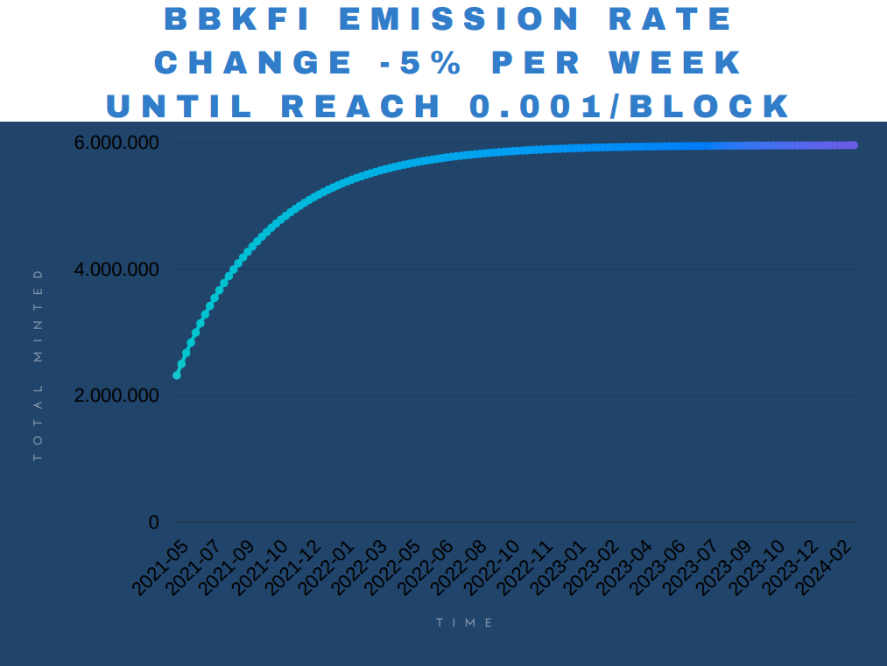

# BBKFI Tokenomics

<figure><figcaption></figcaption></figure>

**Ticker: BitBlocks Finance (BBKFI)**

Contract Address: [https://bscscan.com/token/0xfc8e68e30350c6603d3d29fcc8e676380c28fcf4](https://bscscan.com/token/0xfc8e68e30350c6603d3d29fcc8e676380c28fcf4)\
Chain: Binance Smart Chain (BEP-20)\
Supply: Unlimited

**Emission Rate:**

0.001 BBKFI/block\
28.8 BBKFI/day\
9.09% will be sent to the developer address for future partnerships and development funds.

**Update 03/06/2021:**\
BBKFI had a fixed emission of 1 BBKFI/day before the proposal of 05/06/2021\
More information in the proposal: [https://snapshot.org/#/bitblocks.eth/proposal/QmRDMCqZNThUGKyYWQfo2M9vqekiA4CdkVnY5LKwmLq8Ak](https://snapshot.org/#/bitblocks.eth/proposal/QmRDMCqZNThUGKyYWQfo2M9vqekiA4CdkVnY5LKwmLq8Ak)

<figure><figcaption></figcaption></figure>

**Deflationary Mechanics:**

* Farms and Blocks factory will receive corresponding BBKFI depending on the multiplier shown in the top left corner. The higher the multiplier, the more priority that farm will have during the distribution of tokens

#### Token Burn

Token burn happens automatically via games, events, and deflationary tokens.

This section covers the main information about the BBKFI token, including emission rates, distribution, and deflationary mechanisms. Be sure to review and understand these details before participating in the BitBlocks Finance ecosystem.